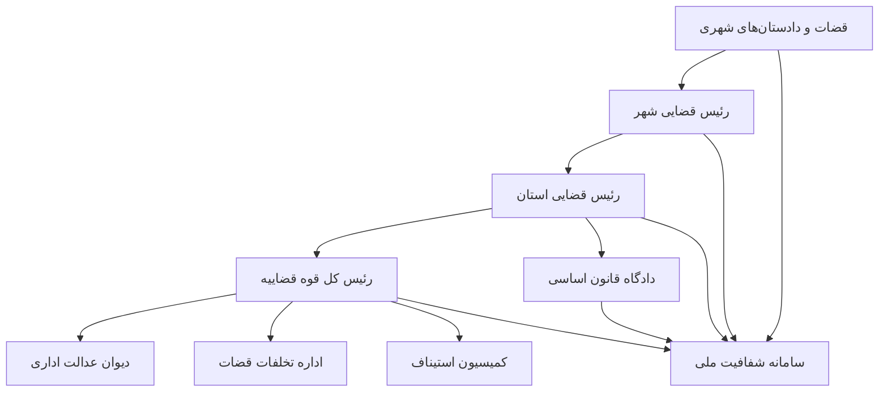

# ساختار قوه قضاییه

```mermaid
flowchart TD

LocalJudges[قضات و دادستان‌های شهری]

CityChief[رئیس قضایی شهر]

ProvinceChief[رئیس قضایی استان]

ChiefJustice[رئیس کل قوه قضاییه]

ConstCourt[دادگاه قانون اساسی]

AdminCourt[دیوان عدالت اداری]

Discipline[اداره تخلفات قضات]

Appeal[کمیسیون استیناف]

Transparency[سامانه شفافیت ملی]

LocalJudges --> CityChief

CityChief --> ProvinceChief

ProvinceChief --> ChiefJustice

ProvinceChief --> ConstCourt

ChiefJustice --> AdminCourt
ChiefJustice --> Discipline
ChiefJustice --> Appeal

LocalJudges --> Transparency
CityChief --> Transparency
ProvinceChief --> Transparency
ChiefJustice --> Transparency
ConstCourt --> Transparency
```
