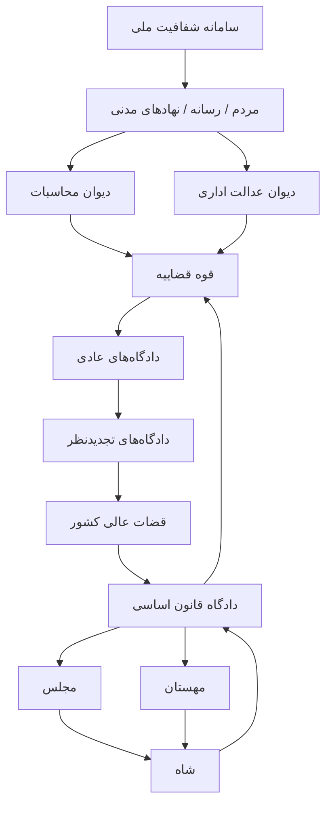

# ساختار قوه قضاییه و نهادهای نظارتی

```mermaid
flowchart TD

Citizen[مردم / رسانه / نهادهای مدنی]

Transparency[سامانه شفافیت ملی]

Audit[دیوان محاسبات]

AdminCourt[دیوان عدالت اداری]

Judiciary[قوه قضاییه]

LocalCourts[دادگاه‌های عادی]
Appeal[دادگاه‌های تجدیدنظر]
HighJudges[قضات عالی کشور]

ConstCourt[دادگاه قانون اساسی]

King[شاه]

Parliament[مجلس]
Mehestan[مهستان]

%% شفافیت و نظارت عمومی
Transparency --> Citizen
Citizen --> Audit

%% دیوان محاسبات
Audit --> Judiciary

%% دیوان عدالت اداری
Citizen --> AdminCourt
AdminCourt --> Judiciary

%% ساختار قضایی
Judiciary --> LocalCourts
LocalCourts --> Appeal
Appeal --> HighJudges

%% انتخاب قضات قانون اساسی
HighJudges --> ConstCourt

%% فعال‌سازی بحران
Parliament --> King
Mehestan --> King

King --> ConstCourt

%% نظارت قانون اساسی
ConstCourt --> Parliament
ConstCourt --> Mehestan
ConstCourt --> Judiciary
```
